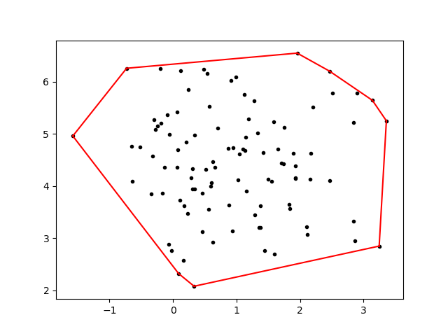
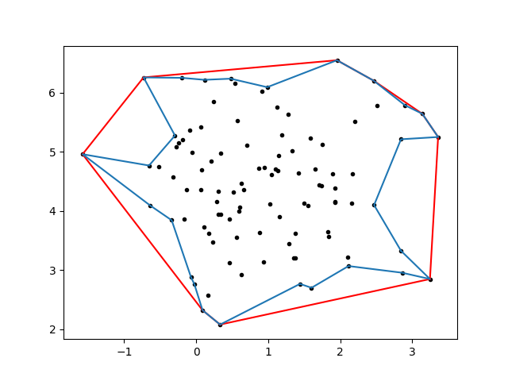

In my recent research, I've stumbled across the fascinating topic of hulls. For simplicity, we can define a hull to be an n-sided polygon that encloses all points p ∈ S, a set of k points. The most common type of hull is a convex hull, which is the smallest convex polygon that contains S, in contrast to the more rarely seen concave hull, which we can define to be the smallest polygon that encloses S. The difference between the two is, of course, that a convex hull is constrained to be an actually convex shape, whereas the concave hull has no such restriction.

Why use a hull?
====
There's actually a ton of interesting applications of hulls. One particularity novel use is described in [this](ttps://github.com/adam-p/markdown-here/wiki/Markdown-Cheatsheet#links) cool blog post, which uses an alpha shape approximation to find contours of places from geotagged data. One common use of a hull is to postprocess the result of a clustering algorithm, such as k-means or DBSCAN. This is the application I was originally concerned with.

What kind of hull?
====
The easiest type of hull to use is the convex hull. There's several Python implementations of the convex hull, included in projects like [scipy](https://www.google.com/url?sa=t&rct=j&q=&esrc=s&source=web&cd=1&cad=rja&uact=8&ved=2ahUKEwjPt-3p4o3jAhWVQs0KHfG3Bj0QFjAAegQIBBAB&url=https%3A%2F%2Fdocs.scipy.org%2Fdoc%2Fscipy%2Freference%2Fgenerated%2Fscipy.spatial.ConvexHull.html&usg=AOvVaw2xCnhbutY0EXwZIA8vYy14), [OpenCV](https://docs.opencv.org/3.4/d3/dc0/group__imgproc__shape.html#ga014b28e56cb8854c0de4a211cb2be656), and [Shapely](https://shapely.readthedocs.io/en/stable/manual.html). The convex hull is quite intuitive, conceptually. Let's dive into some code.

<pre class="prettyprint lang-py">
<code>
import matplotlib.pyplot as plt
from sklearn.datasets.samples_generator import make_blobs
from scipy.spatial import ConvexHull

X, y = make_blobs(n_samples=100, centers=1, n_features=2, random_state=0)

hull = ConvexHull(X)

for simplex in hull.simplices:
    plt.plot(X[simplex, 0], X[simplex, 1], 'k-', color = 'red')

plt.scatter(*zip(*X), marker = '.', color = 'black')
plt.show()
</code>
</pre>
Output:

<!---*** for fucking color change in the syntax lol--->

Cool, that was easy! We've succesfully associated some sort of area with these points, which we can find with various methods. Scipy in particular has already done this for us, so there's no need to do it explicitly. Mathematically, a common method is through [Green's Theorem](https://en.wikipedia.org/wiki/Green%27s_theorem), which you might remember from vector calculus.  

So what's the problem here?
====
The problem is that it a convex hull can be a (surprise!) bad approximation for a concave shape. Ideally, a concave hull would look more like the blue line:

This is clearly much more accurate, although still an approximation. But how do we get here?

What's the deal with concave hulls?
====
Unfortunately for us, it ain't as easy as the convex hull. None of the previously mentioned libraries have a built-in function for the concave hull, and for good reason. The problem is that finding a perfect concave hull is actually [NP-complete](https://en.wikipedia.org/wiki/NP-completeness). If you're not familiar with the notion of NP-completeness, it essentially means that the problem is incredibly difficult to solve (Non Polynomial time!) and (the cool part) if we solve one NP-complete problem, we've solved them all!

NP-Complete?
====
The process of determining if a problem is actually NP-complete is termed a reduction; that is, we mean to transform the problem into something else that we know is NP-complete. Therefore, every problem in the class is merely a rephrasing of the rest. In this case, we can fairly trivially show that finding a concave hull reduces to a problem called the "min-area traveling salesperson".

The traveling salesperson problem is fairly simple to describe. From [Wikipedia](https://en.wikipedia.org/wiki/Travelling_salesman_problem):

>"Given a list of cities and the distances between each pair of cities, what is the shortest possible route that visits each city and returns to the origin city?"

We can visualize this graphically like so:

That looks like something we recognize! We've actually enclosed the minimal area, which was what we defined a concave hull to be earlier. Although our visual intuition is enough for the purposes of this blog post, you can find a more formal proof in papers by [Fekete et al.](https://arxiv.org/pdf/1309.7829.pdf) and [Asaeedi et al.](https://arxiv.org/pdf/1309.7829.pdf).

As a side note, for those of you who know quite a bit about complexity theory (and before I get emails to correct me), the traveling salesman problem is actually NP-hard, rather then NP-complete because it's not technically a decision problem. However, the min-area traveling salesman is, as we can reduce it to finding a Hamiltonian cycle in a planar digraph, which is NP-complete as shown by [Garey et al](https://www.cs.princeton.edu/courses/archive/spring04/cos423/handouts/the%20planar%20hamiltonian.pdf).. If I've still got this wrong, please let me know!

Back to the matter at hand: there's not really an easily available package for concave hulls because it's actually hard to compute one.

So now what?
====
Now we delve into waters of approximations. Fortunately for us, some really smart people has already thought about this in numerous blog posts. I particularity like [this one](https://sgillies.net/2012/10/13/the-fading-shape-of-alpha.html) by Sean Gillies, who wrote Shapely/fiona and [this post](http://blog.thehumangeo.com/2014/05/12/drawing-boundaries-in-python/) by Kevin Dwyer, who expanded on Sean's ideas and gave a really nice explanation.

As both of those posts provide excellent explanation, I won't repeat it here. However, I have taken the liberty of creating a small class based on Sean's and Kevin's work for my own personal use to streamline the process the bit (and generate the figure with the concave approximation above!) You can [find it on my GitHub](https://gist.github.com/bp0017/bf7e548a04f133d53ebac41f3e2b8ad7) if you want to play around with it a bit.
