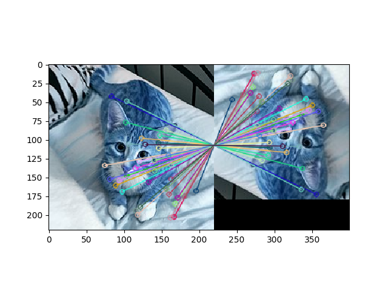

In computer vision applications, it's common to encounter a scenario where feature extraction/matching would be useful.
There are two quite well-known algorithms for this purpose, SIFT and SURF. Although these are not the only options,
they are robust and tested on a variety of data sets.

What are SIFT/SURF?
======  
SIFT (Scale Invariant Feature Transform) was patented in 1999 by David Lowe. In general, the algorithm uses filtering techniques
to extract keypoints of an image, and a set of descriptors to go along with the keypoints. SURF (Speeded Up Robust Features) is a modified version designed for greater speed. A common application of SIFT/SURF is in object recognition.

Where can I find implementations?
======
Unfortunately for us, the most popular Python computer vision library, OpenCV, doesnt support SIFT and SURF from the default install, which most users get through `pip`. This is because SIFT and SURF are patented, and you're supposed to pay the authors for use. Thus, OpenCV has segregated them in order to make this clear. However, from as user's standpoint, this creates some difficulty.

How can I configure OpenCV?
======
There's two seperate methods to this end. The first, and more difficult, is to recompile OpenCV from source in order to enable a certain flag (`OPENCV_ENABLE_NONFREE`) when building with `cmake`. This method is well documented [here](https://www.pyimagesearch.com/2018/05/28/ubuntu-18-04-how-to-install-opencv/). This alters the default OpenCV install, which is fine if you're the only user, but generally frowned upon in a multiuser environment. The preferred method is again using `pip`, but with some modifications.

As a general rule, it's best practice to use [virtual enviroments](https://docs.python.org/3/tutorial/venv.html). You can create a virtual enviroment with

<code>
virtualenv name_of_your_environment
</code>

If virtualenv is not installed, you can do that with `pip install virtualenv`.
To activate it, all you have to do is

<code>
source name_of_your_environment/bin/activate
</code>

The advantage of using virtual environments is so you can isolate packages. We use them here as we want to install a previous version of OpenCV. Why do this? After OpenCV Version 3.4.2.16, the OpenCV devs removed the option to install SIFT/SURF using `pip`, which would force us to go the recompilation route. As such, we need to install a previous version of OpenCV before this capability was removed. We can do this as normal:

<code>
pip install opencv-python==3.4.2.16
pip install opencv-contrib-python==3.4.2.16
</code>

Then, you're all set! Let's do a quick object matching test.
Let's use this cat that was the first thing that came up when I Googled "cat".
We are going use SIFT to match the original image with a rotated, blurred, and cropped version.

 

<pre>

<code>
import cv2 #import our library
import matplotlib.pyplot as plt #for plotting

cat = cv2.imread('cat1.jpg') #read images
cat_rotated = cv2.imread('cat2.jpg')

sift = cv2.xfeatures2d.SIFT_create() #create our SIFT detector

keypoints_1, descriptors_1 = sift.detectAndCompute(cat,None) #find our keypoints and descriptors
keypoints_2, descriptors_2 = sift.detectAndCompute(cat_rotated,None)

bf_matcher = cv2.BFMatcher(cv2.NORM_L1, crossCheck=False) #create our keypoint matcher

matched_descriptors = bf_matcher.match(descriptors_1,descriptors_2) #match descriptors

matches = sorted(matched_descriptors, key = lambda x:x.distance) #sort by distance to get more relevant matches
out =  cv2.drawMatches(cat,keypoints_1,cat_rotated,keypoints_2,matches[:40],None, flags=2)
plt.imshow(out)
plt.show()
 </code>

We appear to have a good match.
