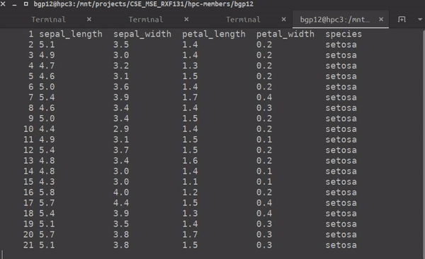

I spend much of my time ssh'ed into a remote machine (my school's high performance computing cluster) and often come across .csv files that I'd like to view. `cat`, although fast, does not handle .csv's in any special way, and if the .csv is not short and simple, can result in unintelligible output. I was recently diving through my organization's .bashrc and found this handy script.

<pre class="prettyprint">
function pcsv() {

cat $1 | sed -e 's/,,/, ,/g' | column -s, -t | less -#5 -N -S

}
</pre>

which results in some pretty nicely formatted output.

<figure>

<figcaption> from the Iris dataset </figcaption>
</figure>

Thanks to whichever fed up grad student that wrote this.
